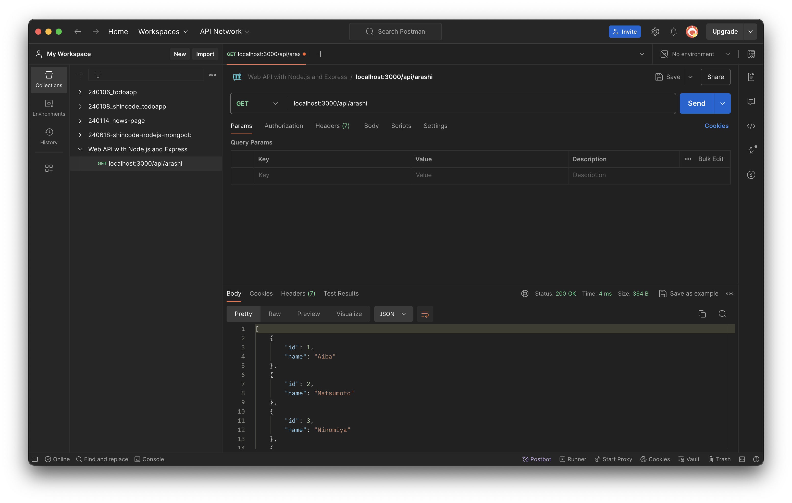

# Web API with Node.js and Express

- 概要: Node.js と Express を使って、CRUD 操作を行うための基本的な Web API を作成。
- 開発環境
  - node: v22.2.0
  - npm: 10.7.0

## 手順

1. [package.json の作成](#packagejson-の作成)
1. [依存関係のインストール](#依存関係のインストール)
1. [node の動作確認](#node-の動作確認)
1. [nodemon の動作確認](#nodemon-の動作確認)
1. [サーバーを起動し、リクエストを受け取る準備をする](#サーバーを起動しリクエストを受け取る準備をする)
1. [最初のルーティングを設定する](#最初のルーティングを設定する)
1. [HTTP GET requests のルーティングを設定する](#http-get-requests-のルーティングを設定する)
1. [Postmanのインストールと、データの確認](#postmanのインストールとデータの確認)
1. [JSON形式のリクエストボディを解析するためのミドルウェアを設定する](#json形式のリクエストボディを解析するためのミドルウェアを設定する)
1. [HTTP POST requests のルーティングを設定する](#http-post-requests-のルーティングを設定する)
1. [HTTP PUT requests のルーティングを設定する](#http-put-requests-のルーティングを設定する)
1. [HTTP DELETE requests のルーティングを設定する](#http-delete-requests-のルーティングを設定する)


### `package.json` の作成

`package.json` を作成したいプロジェクトフォルダの中で、以下のコマンドを実行する。

```sh
npm init -y
```

#### `package.json` とは [^1]

- プロジェクトが利用するモジュールやライブラリのリストを記載するファイル
- 言い換えると、プロジェクトが依存するパッケージのリストのこと
- 記載はモジュールやライブラリのインストール時に自動で書き込まれる
- モジュールやライブラリのバージョンが指定される
- なぜ必要なのか？
  - `package.json` をもとに必要な依存関係をインストールして開発するため


#### `npm init -y` とは 

デフォルトの `package.json` を作成するコマンド。

- `npm init` とは [^2]
  - `package.json` を CLI で情報を入力して作成するためのコマンド
  - 具体的には、`npm init` をたたいた後、packgename、description、entrypoint などをコマンドラインで入力することができる
- `npm init -yes` or `npm init -y` とは [^3]
  - デフォルトの `package.json` を作成するためのコマンド
  - `npm init` とは違い、CLI で情報を入力しない
- CLI（Command Line Interface）とは
  - テキストベースのコマンドを利用して、コンピューターと対話するための手段


### 依存関係のインストール

以下のコマンドを実行して、プロジェクトに Express、nodemon をインストールする。

```sh
npm install express
npm install nodemon --save-dev
```
#### Express とは [^4]

Node.js を簡単に書くためのフレームワーク。

数多くのHTTPユーティリティメソッドとミドルウェアを利用できるため、堅牢なAPIを迅速かつ簡単に作成できる。

#### nodemon とは [^5]

ファイルの変更が検知された時、自動的に node アプリケーションを再スタートするツール。

具体的な動きとしては、`index.js` を保存したら、`node index.js` を再度実行してくれる。
このツールは、`npm run dev` といったコマンドを何度も入力する手間をなくしてくれる。

#### `npm install` とは [^6] [^7] [^8]

- `npm install <package-spec>` とは
  - アプリケーションに必ず必要なパッケージを `dependencies` としてインストールするコマンド
  - Expressは サーバー作成に必要なので、こちらでインストール
- `npm insatall <package-spec> --save-dev` とは
  - 開発の間にだけ必要なパッケージを `devDependencies` としてインストールするコマンド
  - テストフレームワークやビルドツールなど
  - nodemon は開発の時だけ必要なので、こちらでインストール


### node の動作確認

ルートディレクトリに `index.js` を作成、以下を記述。

```js
console.log("Hello World");
```

`package.json` の `scripts` に `dev` を記述。

```json
{
  "scripts": {
    "dev": "node index.js"
  },
}
```

ターミナルで以下を実行し、Node.js で index.js ファイルが実行できるか確認する。

実行するとターミナルに `Hello World` と表示される。

```sh
npm run dev
```

#### `package.json` の `scripts` とは [^9]

- Node.jsプロジェクトで実行するカスタムコマンドを定義する場所（セクション）。
- `npm run <user defined>` で実行できる
- `npm-run-script` とは [^10]
  - `package.json` の `scripts` に記述されたコマンドを実行する


### nodemon の動作確認

package.json の `node` を `nodemon` に書き換える。[^11]

```json
{
  "scripts": {
    "dev": "nodemon index.js"
  },
}
```

ターミナルで以下を実行し、Node.js で index.js ファイルを更新するたびに、node が再実行されているか確認する。

```sh
npm run dev
```

ターミナルの結果

きちんと、`node index.js` が再実行されている。

```sh
[nodemon] 3.1.3
[nodemon] to restart at any time, enter `rs`
[nodemon] watching path(s): *.*
[nodemon] watching extensions: js,mjs,cjs,json
[nodemon] starting `node index.js`
Hello World
[nodemon] clean exit - waiting for changes before restart
[nodemon] restarting due to changes...
[nodemon] starting `node index.js`
Hello World, Hi
```

### サーバーを起動し、リクエストを受け取る準備をする

`index.js` [^11] [^12]

```js
const express = require("express");
const app = express();
const port = 3000;

app.listen(port, () => {
  console.log(`Example app listening on port ${port}`)
})
```

ターミナルで `Example app listening on port 3000` と表示されていることを確認する。
この時、次にファイルの変更があるまで、サーバーは起動したままになっている。

```sh
[nodemon] restarting due to changes...
[nodemon] starting `node index.js`
Example app listening on port 3000
```

3000 ポートでサーバーを起動しているので、以下のURLをたたくと、ページにアクセスできる。
まだ、GET メソッドを設定していないので、 `Cannot GET /` と表示される。

```
http://localhost:3000/
```

#### Express モジュールの基本的な使い方

Express のモジュールを利用するために必要な手順は以下の通りです。

Express モジュールをインポートし、それを `express` という定数に格納する。

```js
const express = require("express");
```

Expressアプリケーションのインスタンスを作成し、それを `app` という定数に格納する。

これにより、 `app` を使って、ルート設定ができる。

```js
const app = express();
```

#### サーバーを起動した状態にし、リクエストを待ち受ける [^13]

```js
app.listen(port, () => {
  console.log(`Example app listening on port ${port}`)
})
```

- `app.listen([port[, host[, backlog]]][, callback])`
  - 特定のホストとポートで接続を結びつけて、データを待ち受ける。
  - HTTPリクエストを受け取るために必要な設定。
  - `port` の URL `http://localhost:3000/` にアクセスすることができる（ただし、この段階では `Cannot GET /` としか表示されない）


### 最初のルーティングを設定する

HTTP GET requests のルーティングを設定するため、`index.js` に以下の記述を追加する。

```js
app.get("/", (req, res) => {
  res.send('Hello World!')
});
```

再度、以下のページにアクセスすると `Hello World!` と表示される。

```
http://localhost:3000/
```

#### `app.get(path, callback [, callback ...])` とは

HTTP GET requests のルートを指定し、そこにアクセスすると関数が実行される仕組みを設定する。

#### `res.send([body])`

- HTTP レスポンスを送信する。
- `body` には、Buffer、String、Boolean、Array を指定できる。
- Buffer とは
  - Node.js でバイナリデータを扱うためのオブジェクト。

### HTTP GET requests のルーティングを設定する

arashi のメンバーを表示するルーティングを設定する。

index.js に arashi のメンバーを定義する。

```js
const arashi = [
  { id: 1, name: "Aiba"},
  { id: 2, name: "Matsumoto"},
  { id: 3, name: "Ninomiya"},
  { id: 4, name: "Ohno"},
  { id: 5, name: "Sakurai"},
];
```

以下の URL にアクセスしたら、arashi のメンバーを返すようにするために `app.get()` を記述。

```
http://localhost:3000/api/arashi
```

```js
app.get("/api/arashi", (req, res) => {
  res.send(arashi);
});
```

### Postmanのインストールと、データの確認

- インストール
  - Postman [^14] を公式サイトからインストールする。
  - アカウントを作成する
  - ログインする
- Postmanでの操作
  - 自分の環境で Postman を起動
  - コレクションを作成する
    - Collections で Create new collection として、「Web API with Node.js and Express」とする
  - GETリクエストを作成する
    - 左側のタブの作成したコレクションの「・・・」、もしくはソフト上部の「＋」から "Add request" として、リクエストを作成する
    - method: GET
    - URL: `localhost:3000/api/arashi`
    - 上記を記入したら、右側の "Send" をクリック
    - Body に `arashi` の配列が表示されていれば OK




#### Postman とは？

API開発のためのツール。HTTPリクエストを送信して、結果を受け取ることができる。HTMLなどでフォームを作ってテストをする必要がないのでお手軽。

### JSON形式のリクエストボディを解析するためのミドルウェアを設定する

POST形式でJSON形式のリクエストボディを解析する必要があるので設定する。

index.js

```js
app.use(express.json());
```

#### `app.use([path,] callback [, callback...])`

> ミドルウェアをアプリケーション全体に適用するためのメソッド。ミドルウェアは、リクエストがサーバーに到達してからレスポンスが返されるまでの間に実行される関数です。<br>
> byChatGPT

#### `express.json([オプション])`

> `express.json()` は、Expressが提供する組み込みのミドルウェア関数の一つで、リクエストの `Content-Type` が`application/json` である場合にそのリクエストボディを解析し、JavaScript のオブジェクトとして `req.body` に設定します。<br>
> byChatGPT


### HTTP POST requests のルーティングを設定する

`idnex.js` に arashi のメンバーを追加するルーティングを作成する。

```js
```

### HTTP PUT requests のルーティングを設定する

### HTTP DELETE requests のルーティングを設定する


[^1]: Creating a package.json file - npm https://docs.npmjs.com/creating-a-package-json-file
[^2]: Running a CLI questionnaire - npm https://docs.npmjs.com/creating-a-package-json-file#running-a-cli-questionnaire
[^3]: Creating a default package.json file - npm https://docs.npmjs.com/creating-a-package-json-file#creating-a-default-packagejson-file
[^4]: Express - Node.js web application framework https://expressjs.com/
[^5]: nodemon - npm https://www.npmjs.com/package/nodemon
[^6]: npm-install - npm Docs https://docs.npmjs.com/cli/v10/commands/npm-install
[^7]: Specifying dependencies and devDependencies in a package.json file - npm Docs https://docs.npmjs.com/specifying-dependencies-and-devdependencies-in-a-package-json-file
[^8]: Difference between dependency and devdependency - Pravin M https://frontendinterviewquestions.medium.com/difference-between-dependency-and-devdependency-2e8812b3f838
[^9]: npm run <user defined> - scripts - npm Docs https://docs.npmjs.com/cli/v10/using-npm/scripts#npm-run-user-defined
[^10]: npm-run-script - npm Docs https://docs.npmjs.com/cli/v10/commands/npm-run-script
[^11]: nodemon Usage - npm https://www.npmjs.com/package/nodemon
[^12]: Hello world example - Express https://expressjs.com/en/starter/hello-world.html
[^13]: Application app.listen - Express https://expressjs.com/en/5x/api.html#app
[^14]: Postman https://www.postman.com/